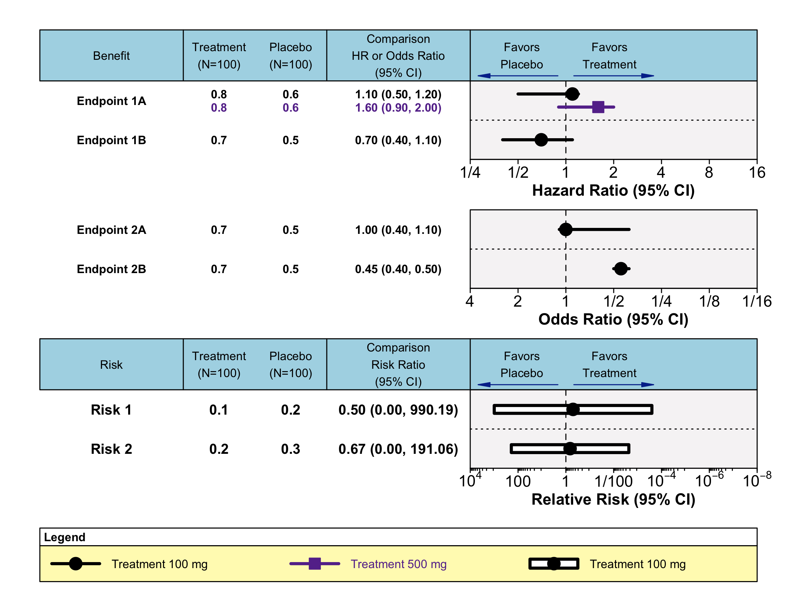

<!-- README.md is generated from README.Rmd. Please edit that file -->

# brrr

<!-- badges: start -->

``` r
usethis::use_lifecycle_badge("experimental")
```

<!-- badges: end -->

The goal of brrr is to …

## Installation

You can install the development version of brrr from
[GitHub](https://github.com/) with:

``` r
# install.packages("devtools")
devtools::install_github("mrppdex/brrr")
```

## Example

This is a basic example which shows you how to solve a common problem:

``` r
library(brrr)
library(tidyr)
library(dplyr)
#> 
#> Attaching package: 'dplyr'
#> The following objects are masked from 'package:stats':
#> 
#>     filter, lag
#> The following objects are masked from 'package:base':
#> 
#>     intersect, setdiff, setequal, union
library(grid)

data(mock_data)

# create benefits header
breaks_widths <- c(0.2, -0.1, 0.1, 0.2)
columns_specs <- c('Benefit'='endpoint', 
              'Treatment\n(N=100)'='treatment', 
              'Placebo\n(N=100)'='placebo',
              'Comparison\nHR or Odds Ratio\n(95% CI)'='col3')
value_collapse <- c(TRUE, FALSE, FALSE, FALSE)

split_axis_by_col <- 'axis_number'
axes_labels_col <- 'estimator'
split_box_by_col <- 'endpoint'

part1_data <- plot_br(mock_data, columns_specs, breaks_widths, 
                      split_axis_by_col, axes_labels_col, split_box_by_col,
                      neutral_pos = 2, num_ticks = 6, 
                      top_margin=NULL, value_collapse=value_collapse)

# risks

data(mock_data_risks)

breaks_width_risks <- c(0.2, -0.1, 0.1, 0.2)

columns_specs_risks <- c('Risk'='endpoint', 
              'Treatment\n(N=100)'='treatment', 
              'Placebo\n(N=100)'='placebo',
              'Comparison\nRisk Ratio\n(95% CI)'='txt_val')

risks_options <- page_options$new()
label_font_size <- risks_options$get_label_font_size()*1.2
risks_options$set_label_font_size(label_font_size)

part2_data <- plot_br(mock_data_risks, columns_specs_risks, breaks_width_risks,
                      split_axis_by_col, axes_labels_col, split_box_by_col, 
                      userect=TRUE, neutral_pos = 2, num_ticks = 6, 
                      top_margin=1-part1_data$last_y+0.08,
                      options_br=risks_options)
```


